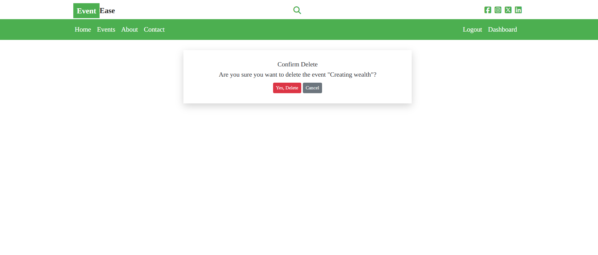
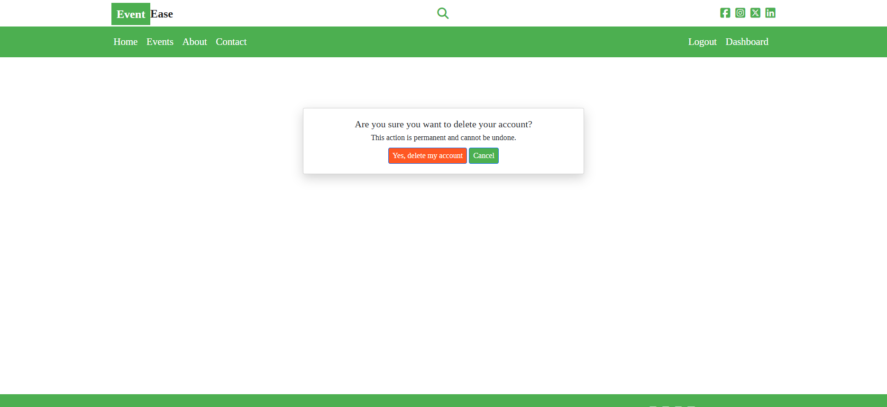

# EventEase


## Introduction

EventEase is an event management and booking app designed to manage webinar events. This is a capstone project work for Code Institute's Full-Stack Software Development programme. In the software development stack are Django, a high-level Python web framework that simplifies development process; PostgreSQL, a powerful relational database system; Bootstrap, a popular CSS library that takes care of styling components.  Django and Postresql together constitute the backend that ensures data integrity and security, while on the other hand Bootstrap, HTML, and JavaScript make up the frontend that provides user experience (UX) in software use. This work implements database manipulation using popular CRUD (Create, Read, Update, and Delete) functionalities. It is inspired to help a friend who is a webinar professional presenter to organise, manage events, and the booking of events by his growing client population. It is for educational purposes only.

View live site here : [EventEase](https://joe-mb-django-event-ease-d4ba6612685d.herokuapp.com/)  
  
For Admin access with relevant sign-in information: [EventEase Admin](https://joe-mb-django-event-ease-d4ba6612685d.herokuapp.com/admin)

<hr>

## Table of Contents

- [EventEase](#Eventase)
  - [Introduction](#introduction)
  - [Table of Contents](#table-of-contents)
  - [Overview](#overview)
- [UX - User Experience](#ux---user-experience)
  - [Design Inspiration](#design-inspiration)
    - [Colour Scheme](#colour-scheme)
    - [Font](#font)
- [Project Planning](#project-planning)
  - [Strategy Plane](#strategy-plane)
    - [Site Goals](#site-goals)
  - [Agile Methodologies - Project Management](#agile-methodologies---project-management)
    - [MoSCoW Prioritization](#moscow-prioritization)
    - [Sprints](#sprints)
  - [User Stories](#user-stories)
    - [Attendee - User Stories](#attendee---user-stories)
    - [User Dashboard/Profile - User Stories](#user-dashboardprofile---user-stories)
    - [Event - User Stories](#event---user-stories)
    - [Booking - User Stories](#booking---user-stories)
    - [About & Contact Us - User Stories](#about--contact-us---user-stories)   
  - [Scope Plane](#scope-plane)
  - [Structural Plane](#structural-plane)
  - [Skeleton \& Surface Planes](#skeleton--surface-planes)
    - [Wireframes](#wireframes)
    - [Database Schema - Entity Relationship Diagram](#database-schema---entity-relationship-diagram)
    - [Security](#security)
- [Features](#features)
  - [User View - Registered/Unregistered](#user-view---registeredunregistered)
  - [CRUD Functionality](#crud-functionality)
  - [Feature Showcase](#feature-showcase)
  - [Future Features](#future-features)
- [Technologies \& Languages Used](#technologies--languages-used)
  - [Libraries \& Frameworks](#libraries--frameworks)
  - [Tools \& Programs](#tools--programs)
- [Testing](#testing)
- [Deployment](#deployment)
  - [Connecting to GitHub](#connecting-to-github)
  - [Django Project Setup](#django-project-setup)
  - [Cloudinary API](#cloudinary-api)
  - [Elephant SQL](#elephant-sql)
  - [Heroku deployment](#heroku-deployment)
  - [Clone project](#clone-project)
  - [Fork Project](#fork-project)
- [Credits](#credits)
  - [Code](#code)
  - [Media](#media)
    - [Additional reading/tutorials/books/blogs](#additional-readingtutorialsbooksblogs)
  - [Acknowledgements](#acknowledgements)

## Overview

Eventease is webinar events management and booking app to help a webinar presenter to organise and manage presentation events. On one hand the presenter can perform operations such as: 

- Create events for presentation
- Show upcoming events
- Update any events
- Delete events
- Delete users
- See analytics about events

On the other hand, users to the app can also perform the following operations: 

- Create account
- Login to the app
- Browse through the events
- Select an event to attend
- Book and pay
- Join and enjoy events
- Cancel an event and get a refund
- Lastly, cancel subscription


The app is intended to primarily help a presenter to showcase upcoming events on the topics that his clients are interested in. It is broswer-based, allowing people to access it through their devices that have internet connection. Since the majority of people use mobile phones and devices, the app is responsive to different sizes of devices. With online presentation on the increase, particularly since the pandemic, webinars are becoming more popular because of their advantages. This app offers lots of advantages to both the presenter and the clients or attendees to such online presentations, and can be customised for events management and billing. 

# UX - User Experience

## Design Inspiration

The app is born out of the need to help a friend who is a professional webinar presenter and a youtuber. He creates online events and invites people to register and attend such events. He does not not have a professional way to manage the activities involved to manage events and booking. This will provide the rudiments to get him started and later add more functionalities for efficiency. By means of this website, he will be able to refer people to the site for upcoming events, and provide all the information they need. 


### Colour Scheme

I used the following colour pallete for the Eventease event management and booking app. 

- Primary colour: ```#4CAF50``` '--green'
- Secondary colour: ```#FFC107``` '--amber'
- Accent colour: ```#FF5722``` '--deep orange'
- Background colour: ```#FFFFFF``` '--white'
- Text colour: ```#212121``` '--dark grey'
- Secondary text colour: ```#757575``` '--grey'
- Error colour: ```#F44336``` '--red'

 

These colours are carefully crafted and chosen to stimulate interest and reassurance in the website. The primary colour of green engenders a feeling of serenity with white text.  

### Font

Using [Google Fonts](https://fonts.google.com/), I used a combination of two Google fonts imported for the project - 'Tinos' and 'Shadows Into Light'. The image below show samples of these fonts. 

  


# Project Planning  
 
## Strategy Plane

Eventease is a platform designed for steamless webinar management and monetization, helping event organisers host high quality virtual events and for users to easily access these events while enjoying both the user-friendliness of the app and the events themselves. This results in audience engagement and revenue generation. This solution provides a seamless operation performance for webinar event organisers and event attendee alike. 

### Site Goals

- Provide an all-in-one platform for scheduling, hosting, and mangaging webinars
- Automate the billing proicess for users or webinar attendees
- Offer analytic and insights for event organisersto optimize future webinars
- Enhance audience engagement with the user-friendly tools
- Customised for all users and devices through resposiveness and user-friendliness
- Can be a source of revenue generation for organisers through the sale of events
- Organisers can manage events, booking, and users

The target audience includes webinar organisers and other event organisers, and the webinar events attendees, who want to keep up with the upcoming events. This is because the app can be tweaked a little for other events management and booking.

## Agile Methodologies - Project Management

The project is organised and divided into segments or parts that make for ease of implementation and inremental development. I used Github for Agile planning and development. This is the project board in Github [Github Projects Board](<https://github.com/users/JoeMburu/projects/9>).

### MoSCoW Prioritization

I chose the MoSCoW Prioritization method for Eventease project, dividing and labeling the component tasks as follows:

- **Must Haves**: the 'required', critical components of the project. Completing my 'Must Haves' helped me to reach the MVP (Minimum Viable Product) for this project early, allowing me to develop the project further than originally planned.
  
- **Should Haves**: the components that are valuable to the project but not absolutely 'vital' at the MVP stage. The 'Must Haves' must receive priority over the 'Should Haves'.
- **Could Haves**: these are the features that are a 'bonus' to the project, it would be nice to have them in this phase, but only if the most important issues have been completed first and time allows. These could be considered as the later additions to the project.

### Sprints

My first plan was to reach the MVP (viable minimum product) for this app for the time allocated for this project, three weeks. However, I could not get the project ready within the time allotment, and the student care added another, almost one week. It was overwhelming at first to put all these technologies together for this kind of app, to resolve conflicts and errors that come up during the development, and to document the project. I broke my process into Dev (Developer) Tasks, User Stories and Testing Tasks, which I converted into issues and labelled fully on my projects board. I found adding comments to my issues helpful, as I could quickly record information/sources/fixes for developing later in my README.

## User Stories

User stories and features recorded and managed on [GitHub Projects](<https://github.com/users/JoeMburu/projects/9>)


### Attendee - User Stories

| User Story | Priority |
|----------------------------------------------------------------------------------------------------------------------------|---------------|
| As a **user**, I would like to **view the websites home page** so that I can **learn about it and the services it offers** | **MUST HAVE** |
| As a **user**, I can **find the websites navigation area** so that I **may easily navigate around the website** | **MUST HAVE** |
| As a **user**, I can **see the sites social media links either at the top or bottom of the website** so that I can **visit, contact the business and follow them online** | **MUST HAVE** |
| As a **user**, I can **view any error pages with a 'Home' button** so that I **can get back to the homepage easily** | **MUST HAVE** |
| As a **user**, I want **to see a message when I have successfully/unsuccessfully completed an action** so that I can **receive feedback from my interaction with the website** | **MUST HAVE** |
| As a **user**, I want **to see users testimonials on the home page** so that I can **decide whether I should register to the site or not** | **COULD HAVE** |


### User Dashboard/Profile - User Stories

| User Story | Priority |
|----------------------------------------------------------------------------------------------------------------------------|---------------|    
| As a **user**, I can **use my email and password to login to my profile account/dashboard** so that I can **use my profile to connect to the websites features** | **MUST HAVE** |
| As a **user**, I can **enter my email and password** so that I can **register an account with the website** | **MUST HAVE** |
| As a **user**, I can **enter my personal details** so that I can **create an account with Eventease** | **MUST HAVE** |
| As a **user**, I can **receive feedback in the form of a logout page** so that **I can confirm that I have been logged out successfully** | **MUST HAVE** |
| As a **user**, I can **edit my user profile** to **update my personal details** | **MUST HAVE** |
| As a **user**, I can **click a delete button in my user profile setup** so that I **can delete all personal data, photos and bookings that are connected to me on the website and close account** | **COULD HAVE** |


### Event - User Stories

| User Story | Priority |
|----------------------------------------------------------------------------------------------------------------------------|---------------|
| As an **admin**, I want to be able to **create events** so that I can **show upcoming events on related topics** | **MUST HAVE** |
| As a **user**, I would like to **see the upcoming events** so that I can **choose interesting upcoming events to attend** | **MUST HAVE** |
| As a **user**, I can **click on detailed information button about an event** so that I **can view the event detailed page** | **MUST HAVE** |
| As a **user**, I can **visit an event detailed page** so that I **can read more about such an event** | **MUST HAVE** |
| As a **user**, I can **click a like event icon button** so that I **can like/unlike an event** | **COULD HAVE** |
| As a **user**, I can **click on Book Now button** so that I can **book an event** | **MUST HAVE** |
| As a **user**, I can **click on Pay for event button** so that I can **pay for an event to attend an event** | **MUST HAVE** |
| As an **admin**, I can **click on the event delete button on the event detailed page** so that I can **delete the event when not needed** | **MUST HAVE** |
| As a **user**, I can **enter a search term into the search bar** so that I can **search for particular events with information topics that I am interested in** | **COULD HAVE** |


### Booking - User Stories

| User Story | Priority |
|----------------------------------------------------------------------------------------------------------------------------|---------------|
| As a **user**, I can **view the bookings page** so that I can **learn about booking and see my active bookings** | **MUST HAVE** |
| As a **user**, I can **cancel my event booking** so that I **can get a refund for booking the event** | **MUST HAVE** |
| As an **admin**, I can **get the event analytics** so that I can **get historical information about bookings** | **MUST HAVE** |
| As a **user**, I can **get information about my booked events feedback from the website** that will **explain that only four active bookings are allowed per person** | **SHOULD HAVE** |


### About & Contact Us - User Stories

| User Story | Priority |
|----------------------------------------------------------------------------------------------------------------------------|---------------|
| As a **user**, I can **view the 'About us page** so that I can **get to read about the organisatio, visions and missions** | **COULD HAVE** |
| As a **user**, I can **contact information about the presenter** so that I can **leave questions** | **COULD HAVE** |
| As a **user**, I can **see contact us form** so that I can **ask for the presenter to contact me** | **SHOULD HAVE** | 

    
    
## Scope Plane

I started with the event management (scheduling) and later added the booking system to be able to meet the MVP requirements of the project. Overall, the scope of the project is listed below.These are the functions expected for the app.

Essential features of my project were:

- Responsive website for users of mobile, tablet and desktop devices
- User Authentication
- Attendee dashboard and profile creation and editing
- Admin dashboard for app operations and analytics
- Event feature with full CRUD functionality
- Booking feature with full CRUD functionality
- Event search feature
- Business details to inform the user

Based on the above app functions, I will like to explain a little about the user registration and authentication, and webinar scheduling and management. Users are not required to register and login for browsing through the events and looking at the detailed information on each event. But registration and authentication are required for booking events. The function requires a user to sign up, log in. They will use email/password authentication for this. The second function is that the host or admin should be able to create, edit, and delete webinar events. This he does by means of the title, description, changing event image or other fields.


## Structural Plane

Users interact with the app through the app navigation. To find the upcoming events, users need to go to the events menu and browse through, the register, book an event, pay for an event, and then join and enjoy the event. These are the steps required to accomplish these tasks. The user interacts with the system through menus. The menus are self-explanatory and easy to navigate around to perform one's operations. Events are designed using the CSS cards that will make each event look as compact as possible. Below is an example of the app's navigation and event as a card. 
 
**Sample of a navigation menubar** 


   
**Sample of an event as a CSS card**

## Skeleton & Surface Planes

### Wireframes

The wireframes for Eventease were created in Balsamiq, which the institute gave us a free key for the use. It was really fun using this app to create the mockups for the app. With the mockup wireframes in place, it was like a guide when the coding started to you on track.

**Mobile/Tablet view for:**  

- Home
- Login
- Detailed Page

Originally I had planned for the home page to be mostly icon based for quick and easy use. However, I felt that this format would suit a downloadable app version of FreeFido, instead of the web version, which regular users might avail of to give them quicker access to the booking page, especially if they are one-handed, walking the dog on the way to the park. This will be part of my future features for the project growth.

<details>
    <summary>Mobile Home Page Wireframe</summary>  
      
      
</details>
  
<details>
    <summary>Tablet login Page Wireframe</summary>  
    
</details>

<details>
    <summary>Mobile Detailed Page Wireframe</summary>  
    
</details>

**Desktop view for:**

- Home
- Events
- detailed

<details>
    <summary>Desktop Home Page Wireframe</summary>  
      
</details>

<details>
    <summary>Desktop Events Page Wireframe</summary>  
    
</details>

<details>
    <summary>Desktop Detailed Page Wireframe</summary>  
    
</details>


### Database Schema - Entity Relationship Diagram

  
*Database Schema (ERD) for FreeFido displaying relationships between feature components saved within the database*

This Entity Relationship Diagram(ERD) demonstrates how each feature interacts with each other and the connected PostgreSQL Database. Using Django's User Model, which I customized and Django AllAuth to carry out all user authentication, a user_id is created when the user registers with their email, username, and password. We have three models here, and the relationship between users and events is one to many. This means that one user (admin) can create many events. This is the same relationship between events and bookings, one event can have many bookings. There is also one to many relationship between users and bookings. This means that one user can have many bookings. This relationship is governed by the primary key and the foreign key relationship.


### Security

This project used the security features in some libraries. One of such is the authentication framework, AllAuth, which integrates into app to provide a login authentication security.

**AllAuth**  

Django AllAuth is an installable framework that takes care of the user registration and authentication process. Authentication is needed to determine when a user is registered or unregistered and it controls what content is accessible on Eventease. The setup of AllAuth included:

- installing it to my workspace dependencies
- adding it to my INSTALLED_APPS in my settings.py
- sourcing the AUTHENTICATION_BACKENDS from the AllAuth docs for my settings.py
- adding its URL to my projects 'urls.py'
- run database migrations to create the tables needed for AllAuth
- For this first version of Eventease, to meet MVP, email and social accounts were not configured as part of the feedback/sign up options to the user. They will be included with the next release.
  
**Defensive Design**  

FreeFido was developed to ensure a smooth user experience, to the best of my current learning experience with Django. 

- Input validation and error messages provide feedback to the user to guide them towards the desired outcome. 
- Unregistered users are diverted to the Sign Up page from restricted access pages. 
- Authentication processes control edit/delete icons to reveal them to the content author only. 
- Deletion of data is confirmed through an additional modal, double-checking with the user.

**CSRF Tokens** 

CSRF (Cross-Site Request Forgery) tokens are included in every form to help authenticate the request with the server when the form is submitted. Absence of these tokens can leave a site vulnerable to attackers who may steal a users data.  

# Features

## User View - Registered/Unregistered

As a repetition, new users can access Eventease. They do not need to log in to access the home page, the event page, and the detailed page. This is because these pages contain information for public consumption. The following is a breakdown of the site's accessibility for registered/unregistered users:

| Feature   | Unregistered User | Registered, Logged-In User |
|-----------|-------------------|-----------------|
| Home Page | Visible           | Visible         |
| Event Page | Visible           | Visible         |
| About Page | Visible           | Visible         |
| Contact Us Page | Visible           | Visible         |
| Detailed Page   | Visible | Visible |
| Dashboard  | Not Visible | Visible  |
| Booking   | Not Visible | Visible |
| Profile   | Not Visible | Visible |

## CRUD Functionality

Registered users (called Attendees) are able to Create, Read, Update and Delete their preference information on Eventease, as well as Create, Read, and Update their Bookings. Some features make full CRUD functionality available, whilst others present the necessary options only. Here is my CRUD breakdown for Eventease:

| Feature | Create | Read | Update | Delete |
|---------|--------|------|--------|--------|
| Profile | Created upon registration | Yes | Yes | Attendee can cancel account |
| Events | Only the Admin can create an Event | Yes Attendee can read vents | only Admin can update an event | Only Admin can delete an eveny |
| Bookings | Yes | Yes | Yes. Attendee can cancel bookings which is a form of update. Cancel does not delete a booking but changes the flags to CANCELLED AND REFUNDED because his money will be refunded. | No. Only Admin

## Feature Showcase 
  
**Header/Navigation & Footer**

*For features showcase, screenshots of the features

<details open>
    <summary>Header & Navigation - All Users</summary>  
      
      
      
</details>

<details open>
    <summary>Login - Visible to all Users</summary>  
      
     
</details>

The FreeFido footer has been created with a 'wave' background in grey, to complement the whitespace. The social-media icons, from [Flaticon](https://www.flaticon.com), open in a new tab when clicked. Tooltips are again used for those who may not be familiar with the icons. FreeFido does not have any active social media currently so the Facebook link only brings the user to the Facebook sign up page. Twitter, LinkedIn and GitHub bring the user to my own personal accounts connected to the production of this project.


**About Page**

<details>
    <summary>About Page - Visible to all Users</summary>  
      
</details>  

**Contact Page**

<details>
    <summary>Contact Page - Visible to all Users</summary>  
      
</details>  


**Registration/SignUp**

<details open>
    <summary>Sign Up Page</summary>  
      
</details>
  
Users are required to add their Email, Username and Password twice, to ensure the correct one is saved. If any field is not filled in appropriately then a display message is used to inform the user with how to procede to complete the form. The Sign up and Sign in pages are created with default templates available with the AllAuth package. These templates are combined with the power of Bootstraps Crispy Forms pack to give extra control over the forms' appearance.

**Sign In**

<details open>
    <summary>Sign In Page</summary>  
      
</details>


  
*Sign in error*  


**Admin Dashboard**

<details open>
    <summary>Admin dashboard Page - Admin only</summary>  
      
      
</details>
  
**Attendee Dashboard**

<details open>
    <summary>Attendee dashboard Page - Registered Users only</summary>  
    
    
</details>
  
The user profile is created upon registration and displays a placeholder image and 'Edit Profile' button to allow the user to personalise their view. With future releases this page will be accessible to other users and allow connection, currently it is only viewable to the user.
  
<details>
    <summary>Profile Page - Placeholder image for Profile</summary>  
      
</details>
  
  
**Profile Edit**

<details>
    <summary>Edit Profile</summary>  
      
</details>


**Events**

<details open>
    <summary>Event Listing Page </summary>  
      
</details>

<details>
    <summary>Event Detailed Page</summary>  
      
</details>  

**Event Create**

The Admin creates events.

<details open>
    <summary>Event Create Page - Visible only Admin</summary>  
      
</details> 
  
When the user clicks on Book Event, the event is book and the user is redirected to the booking-list
<details>
    <summary>Event Detailed Page</summary>  
        
</details>  
 
 <details open>
    <summary>Event Delete - Visible only to Admin </summary>  
      
</details>


<details open>
    <summary>Cancel Booking (Update)</summary>  
      
</details>

**Attendee Booking list**

<details>
    <summary>Attendee Booking list</summary>  
      
</details>

<hr>
 
  **Close Account**

Attendee can close an account, in that case, he is permanently deleted from the database.
<details open>
    <summary>Close Account (Delete) </summary>  
      
</details>


## Future Features

- **Social account login**: Allowing popular social account login to Eventease website will be an alternative to user registration.
- **Payment system**: I would like to investigate and integrate a payment system to the app.

# Technologies & Languages Used

- HTML
- CSS
- JavaScript
- Python
- [Git](https://git-scm.com/) used for version control.
- [Github](https://www.github.com/) used for online storage of codebase and Projects tool.
- [Balsalmiq](https://balsamiq.com/) for project design planning and wireframe creation.
- [Django](https://www.djangoproject.com/) was used as the Python framework for the site.
- [Cloudinary](https://cloudinary.com/) was used for cloud media storage of user uploaded images.
- [Postresql](https://www.postgresql.org/) was used to host the PostgreSQL database needed to collect and recall the users data.
- [Heroku](https://www.heroku.com) was used to host the FreeFido application.


## Libraries & Frameworks

- Bootstrap v5.2.3
- asgiref==3.8.1
- cloudinary==1.36.0
- crispy-bootstrap5==0.7
- dj-database-url==0.5.0
- dj3-cloudinary-storage==0.0.6
- Django==4.2.17
- django-allauth==0.57.2
- django-crispy-forms==2.3
- django-widget-tweaks==1.5.0
- gunicorn==20.1.0
- oauthlib==3.2.2
- pillow==11.1.0
- psycopg2==2.9.10
- PyJWT==2.10.1
- python3-openid==3.2.0
- requests-oauthlib==2.0.0
- sqlparse==0.5.3
- urllib3==1.26.20
- whitenoise==5.3.0

Further information is available in the [requirements.txt file](requirements.txt)

## Tools & Programs

- [Lucidchart](https://www.lucidchart.com/pages) for ERD (entity relationship diagram) creation.
- [ChatGPT AI](https://chatgpt.com/) for breaking down Python concepts and Django documentation into more understandable chunks.
- [Copilot](https://github.com/features/copilot/) for the hero image pattern SVG.
- [Favicon](https://favicon.io/) for converting an icon into favicon.


# Deployment
  
## Connecting to GitHub  

To begin this project from scratch, you must first create a new GitHub repository using the [Code Institute's Template](https://github.com/Code-Institute-Org/ci-full-template). This template provides the relevant tools to get you started. To use this template:

1. Log in to [GitHub](https://github.com/) or create a new account.
2. Navigate to the above CI Full Template.
3. Click '**Use this template**' -> '**Create a new repository**'.
4. Choose a new repository name and click '**Create repository from template**'.
5. In your new repository space, click the purple CodeAnywhere (if this is your IDE of choice) button to generate a new workspace.

## Django Project Setup

1. Install Django and supporting libraries: 
   
- ```pip3 install 'django@4' gunicorn```
- ```pip3 install dj_database_url psycopg2```
- ```pip3 install dj3-cloudinary-storage```  
  
2. Once you have installed any relevant dependencies or libraries, such as the ones listed above, it is important to create a **requirements.txt** file and add all installed libraries to it with the ```pip3 freeze --local > requirements.txt``` command in the terminal.  
3. Create a new Django project in the terminal ```django-admin startproject freefido .```
4. Create a new app eg. ```python3 mangage.py startapp booking```
5. Add this to list of **INSTALLED_APPS** in **settings.py** - 'booking',
6. Create a superuser for the project to allow Admin access and enter credentials: ```python3 manage.py createsuperuser```
7. Migrate the changes with commands: ```python3 manage.py migrate```
8. An **env.py** file must be created to store all protected data such as the **DATABASE_URL** and **SECRET_KEY**. These may be called upon in your project's **settings.py** file along with your Database configurations. The **env.py** file must be added to your **gitignore** file so that your important, protected information is not pushed to public viewing on GitHub. For adding to **env.py**:

- ```import os```
- ```os.environ["DATABASE_URL"]="<copiedURLfromElephantSQL>"```
- ```os.environ["SECRET_KEY"]="my_super^secret@key"```
  
For adding to **settings.py**:

- ```import os```
- ```import dj_database_url```
- ```if os.path.exists("env.py"):```
- ```import env```
- ```SECRET_KEY = os.environ.get('SECRET_KEY')``` (actual key hidden within env.py)  

9. Replace **DATABASES** with:

```
DATABASES = {
    'default': dj_database_url.parse(os.environ.get("DATABASE_URL"))
  }
```

10. Set up the templates directory in **settings.py**:
- Under ``BASE_DIR`` enter ``TEMPLATES_DIR = os.path.join(BASE_DIR, ‘templates’)``
- Update ``TEMPLATES = 'DIRS': [TEMPLATES_DIR]`` with:

```
os.path.join(BASE_DIR, 'templates'),
os.path.join(BASE_DIR, 'templates', 'allauth')
```

- Create the media, static and templates directories in top level of project file in IDE workspace.

11. A **Procfile** must be created within the project repo for Heroku deployment with the following placed within it: ```web: gunicorn eventEase.wsgi```
12. Make the necessary migrations again.

## Cloudinary API 

Cloudinary provides a cloud hosting solution for media storage. All users uploaded images in the FreeFid project are hosted here.

Set up a new account at [Cloudinary](https://cloudinary.com/) and add your Cloudinary API environment variable to your **env.py** and Heroku Config Vars.
In your project workspace: 

- Add Cloudinary libraries to INSTALLED_APPS in settings.py 
- In the order: 
```
   'cloudinary_storage',  
   'django.contrib.staticfiles',  
   'cloudinary',
```
- Add to **env.py** and link up with **settings.py**: ```os.environ["CLOUDINARY_URL"]="cloudinary://...."``` 
- Set Cloudinary as storage for media and static files in settings.py:
- ```STATIC_URL = '/static/'```
```
  STATICFILES_STORAGE = 'cloudinary_storage.storage.StaticHashedCloudinaryStorage'  
  STATICFILES_DIRS = [os.path.join(BASE_DIR, 'static'), ]  
  STATIC_ROOT = os.path.join(BASE_DIR, 'staticfiles')‌  
  MEDIA_URL = '/media/'  
  DEFAULT_FILE_STORAGE = 'cloudinary_storage.storage.MediaCloudinaryStorage'
```

## PostgreSql

- Choose a name and select the **Tiny Turtle** plan, which is free.
- Select your Region and the nearest Data Center to you. 
- From your user dashboard, retrieve the important 'postgres://....' value. Place the value within your **DATABASE_URL**  in your **env.py** file and follow the below instructions to place it in your Heroku Config Vars.


## Heroku deployment

To start the deployment process , please follow the below steps:

1. Log in to [Heroku](https://id.heroku.com/login) or create an account if you are a new user.
2. Once logged in, in the Heroku Dashboard, navigate to the '**New**' button in the top, right corner, and select '**Create New App**'.
3. Enter an app name and choose your region. Click '**Create App**'. 
4. In the Deploy tab, click on the '**Settings**', reach the '**Config Vars**' section and click on '**Reveal Config Vars**'. Here you will enter KEY:VALUE pairs for the app to run successfully. The KEY:VALUE pairs that you will need are your: 
   
   - **CLOUDINARY_URL**: **cloudinary://....** 
   - **DATABASE_URL**:**postgres://...** 
   - **DISABLE_COLLECTSTATIC** of value '1' (N.B Remove this Config Var before deployment),
   -  **PORT**:**8000**
   -  **SECRET_KEY** and value  
  
5. Add the Heroku host name into **ALLOWED_HOSTS** in your projects **settings.py file** -> ```['herokuappname', ‘localhost’, ‘8000 port url’].```
6. Once you are sure that you have set up the required files including your requirements.txt and Procfile, you have ensured that **DEBUG=False**, save your project, add the files, commit for initial deployment and push the data to GitHub.
7. Go to the '**Deploy**' tab and choose GitHub as the Deployment method.
8. Search for the repository name, select the branch that you would like to build from, and connect it via the '**Connect**' button.
9.  Choose from '**Automatic**' or '**Manual**' deployment options, I chose the 'Manual' deployment method. Click '**Deploy Branch**'.
10. Once the waiting period for the app to build has finished, click the '**View**' link to bring you to your newly deployed site. If you receive any errors, Heroku will display a reason in the app build log for you to investigate. **DISABLE_COLLECTSTATIC**  may be removed from the Config Vars once you have saved and pushed an image within your project, as can **PORT:8000**.

# Credits

## Code

The following blogs/tutorials complemented my learning for this project, alongside the [Code Institute's](https://codeinstitute.net/ie/) Learning Content.

- [Django Docs](https://www.djangoproject.com/)
- [Bootstrap Docs](https://getbootstrap.com/docs/5.3/getting-started/introduction/)
- [Code Institute's](https://github.com/Code-Institute-Org>) Blog/Boutique Ado walkthroughs
- [ChatGPT](https://chatgpt.com/) Got a lot of help from ChatGPT.


## Media

The following sites were used to gather the photographic media used in FreeFido:

- [Pexels](https://www.pexels.com/)
- [Unsplash](https://unsplash.com/)

